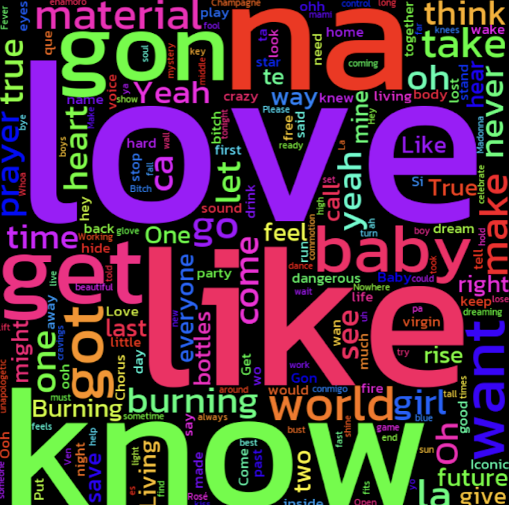
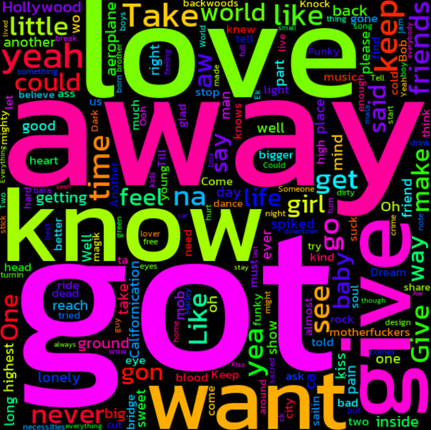

# Artist Predictor

Artist Predictor is a Python-based application designed to predict the artist of a song based on a snippet of its lyrics. The application uses a machine learning model  trained on text data and processes user input through a graphical user interface (GUI) built with tkinter. Additionally, the project includes word clouds to visualize common terms associated with different artists.

## Features

- **Machine Learning**: Predict the artist based on a given snippet of lyrics.
- **Graphical User Interface**: Intuitive and user-friendly interface built using tkinter.
- **Word Clouds**: Visualize the most common words in the lyrics of artists using word clouds.
- **Clear Functionality**: Allows users to clear input and prediction results with a single click.
-  **Command-Line Interface (CLI)**: Provides an alternative way to use the artist prediction model via the terminal.

## Prerequisites

To run this project, you need to have the following installed:

- Python 3.x (preferably 3.8 or higher)
- Required Python libraries (listed below)

## Required Libraries

To install the required libraries, use pip to install them. You can install all dependencies by running:

```bash
pip install -r requirements.txt
```

### Here's a list of key dependencies for this project:

- tkinter – GUI framework.
- scikit-learn – For machine learning and text processing.
- joblib – To load and save machine learning models.
- matplotlib – For creating word clouds and visualizations.
- wordcloud – For generating word cloud images.


### Running the Application

## GUI Application

To run the application:

Clone or download the project repository.
Install the required libraries.
Run the artist_predictor_gui.py script to launch the GUI-based application.

```bash
python artist_predictor_gui.py
```


## CLI Application

To use the command-line interface (CLI) for artist prediction:


Clone or download the project repository.
Install the required libraries.
Run the cli.py script and provide a snippet of lyrics as input. The script will predict the artist based on the lyrics.
Word Clouds

```bash
python cli.py "Here are the lyrics snippet..."
```

## Word Clouds

This project includes the generation of word clouds for different artists, where you can visually explore common words associated with the artists based on the lyrics dataset used in the model. 
These word clouds help to identify frequently used terms and themes in the artists' lyrics.

### Madonna Word Cloud


### RHCP Word Cloud


